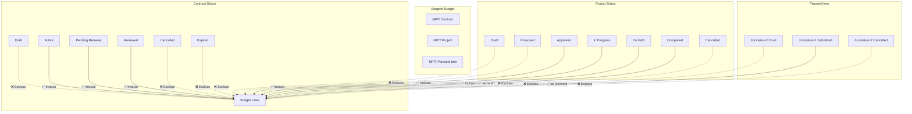
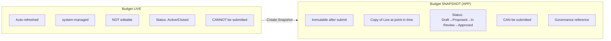
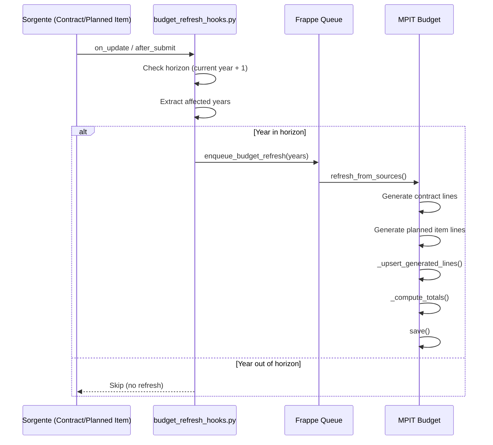
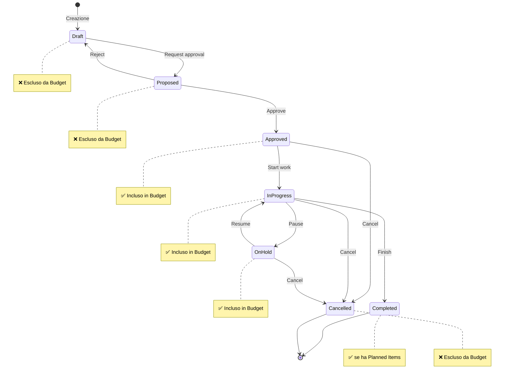
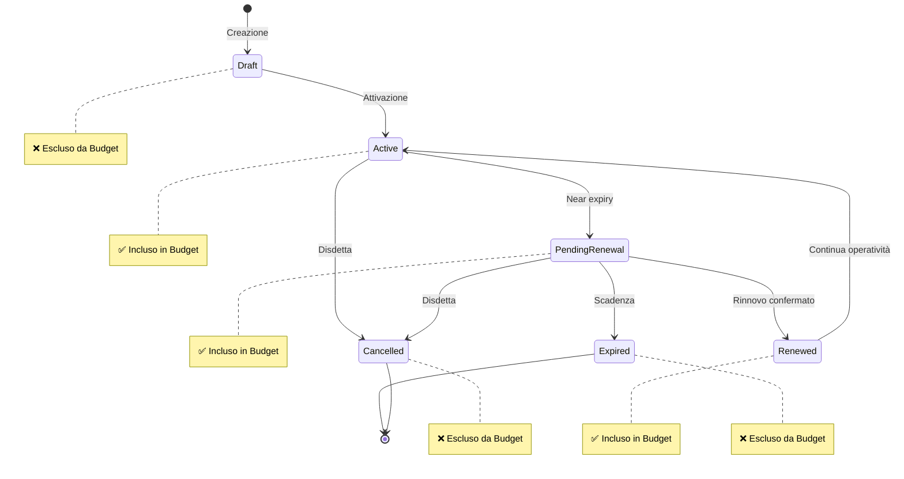
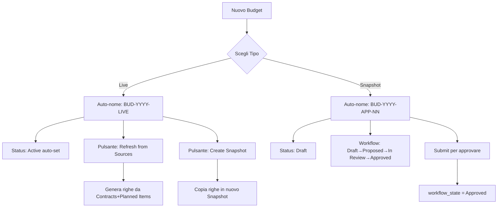
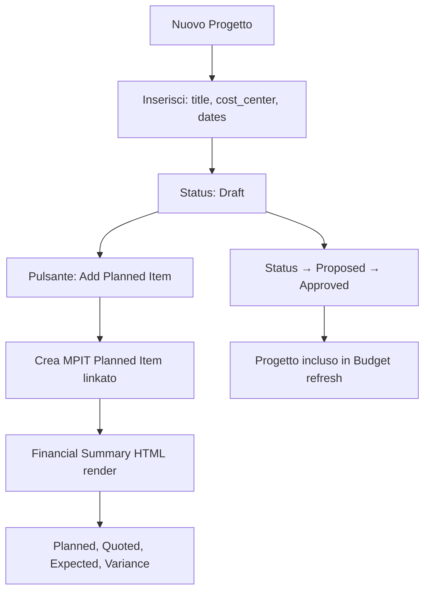
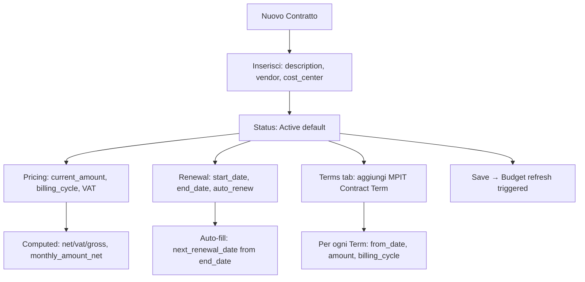

# Analisi Completa: Stati, Workflow e UI/UX — Master Plan IT

> **Documento**: Analisi esaustiva della gestione stati, workflow e flussi UI/UX
> **Data analisi**: 2026-01-07
> **Coverage**: 100% file rilevanti letti e analizzati

---

## Indice

1. [Executive Summary](#1-executive-summary)
2. [Architettura Stati e Workflow](#2-architettura-stati-e-workflow)
3. [MPIT Budget - Analisi Dettagliata](#3-mpit-budget---analisi-dettagliata)
4. [MPIT Project - Analisi Dettagliata](#4-mpit-project---analisi-dettagliata)
5. [MPIT Contract - Analisi Dettagliata](#5-mpit-contract---analisi-dettagliata)
6. [DocType Secondari](#6-doctype-secondari)
7. [Event-Driven Automation](#7-event-driven-automation)
8. [UI/UX Flow Analysis](#8-uiux-flow-analysis)
9. [Documentazione Progettuale](#9-documentazione-progettuale)
10. [Gap e Note Implementative](#10-gap-e-note-implementative)

---

## 1. Executive Summary

### Modello Architetturale

L'applicazione **Master Plan IT** implementa un sistema **FP&A (Financial Planning & Analysis)** per vCIO con:

```
┌─────────────────────────────────────────────────────────────────────────────┐
│                          BUDGET ENGINE V3                                   │
├─────────────────────────────────────────────────────────────────────────────┤
│                                                                             │
│  ┌───────────────┐    ┌───────────────┐    ┌───────────────┐               │
│  │   CONTRACTS   │    │   PROJECTS    │    │ ACTUAL ENTRIES│               │
│  │  (Sorgenti)   │────│  (Sorgenti)   │────│   (Tracking)  │               │
│  └───────┬───────┘    └───────┬───────┘    └───────┬───────┘               │
│          │                    │                    │                        │
│          ▼                    ▼                    ▼                        │
│  ┌────────────────────────────────────────────────────────────────┐        │
│  │                    BUDGET LIVE (Rolling Forecast)              │        │
│  │            Auto-refreshed, system-managed, NOT editable        │        │
│  └──────────────────────────────┬─────────────────────────────────┘        │
│                                 │                                           │
│                                 ▼                                           │
│  ┌────────────────────────────────────────────────────────────────┐        │
│  │               SNAPSHOT (Approved Budget - APP)                 │        │
│  │           Immutable after submit, governance reference         │        │
│  └──────────────────────────────┬─────────────────────────────────┘        │
│                                 │                                           │
│                                 ▼                                           │
│  ┌────────────────────────────────────────────────────────────────┐        │
│  │                         ADDENDUM                               │        │
│  │           Delta adjustments (± amount per Cost Center)         │        │
│  └────────────────────────────────────────────────────────────────┘        │
│                                                                             │
│  CAP (Limite Ufficiale) = Snapshot Approved + Σ Addendum Approved           │
│                                                                             │
└─────────────────────────────────────────────────────────────────────────────┘
```

### Pattern Stato Utilizzato

**NESSUN Frappe Workflow Nativo** - Tutti i DocType hanno `"states": []` vuoto.

La gestione stati è implementata attraverso:

| Componente | Implementazione |
|------------|-----------------|
| **Stati** | Campi `Select` nei JSON (`status`, `workflow_state`) |
| **Transizioni** | Logica Python nei controller (`validate()`, `on_update()`) |
| **Approvazione** | `docstatus` Frappe (0=Draft, 1=Submitted, 2=Cancelled) |
| **Automazione** | `doc_events` in `hooks.py` per trigger refresh |
| **UI/UX** | JavaScript client scripts per pulsanti e calcoli |

---

## 2. Architettura Stati e Workflow

### 2.1 Mapping Stati → Inclusione Budget



### 2.2 Tabella Riassuntiva Stati

| DocType | Campo | Stati Validi (Budget) | Stati Esclusi |
|---------|-------|----------------------|---------------|
| **MPIT Contract** | `status` | Active, Pending Renewal, Renewed | Draft, Cancelled, Expired |
| **MPIT Project** | `status` | Approved, In Progress, On Hold, Completed* | Draft, Proposed, Cancelled |
| **MPIT Planned Item** | `docstatus` | 1 (Submitted) + `is_covered=0` | 0 (Draft), 2 (Cancelled), `is_covered=1` |
| **MPIT Actual Entry** | `status` | Verified (per totali) | Recorded |
| **MPIT Budget Addendum** | `docstatus` | 1 (aggiunge al Cap) | 0, 2 |

*Completed: incluso solo se ha Planned Items non coperti

---

## 3. MPIT Budget - Analisi Dettagliata

### 3.1 Configurazione DocType

| Proprietà | Valore | Riferimento |
|-----------|--------|-------------|
| `is_submittable` | ✅ Sì | [mpit_budget.json L10](file:///usr/docker/masterplan-project/master-plan-it/master_plan_it/master_plan_it/doctype/mpit_budget/mpit_budget.json) |
| `states` | `[]` vuoto | [mpit_budget.json L258](file:///usr/docker/masterplan-project/master-plan-it/master_plan_it/master_plan_it/doctype/mpit_budget/mpit_budget.json#L258) |
| Campo stato | `workflow_state` | Select con 6 opzioni |
| Campo tipo | `budget_type` | Live / Snapshot |

### 3.2 Budget Type: Live vs Snapshot



### 3.3 Stati per Tipo di Budget

#### Live Budget

| Stato | Validazione | Auto-assegnato |
|-------|-------------|----------------|
| **Active** | Anno corrente/futuro | ✅ `_enforce_status_invariants()` |
| **Closed** | Anno passato (end_date < today) | ✅ `_enforce_status_invariants()` |

```python
# File: mpit_budget.py L620-630
if self.budget_type == "Live":
    year_start, year_end = annualization.get_year_bounds(self.year)
    if _getdate(nowdate()) > year_end:
        self.workflow_state = "Closed"
    else:
        self.workflow_state = "Active"
```

#### Snapshot Budget

| Stato | docstatus | Transizione |
|-------|-----------|-------------|
| **Draft** | 0 | Iniziale |
| **Proposed** | 0 | User action |
| **In Review** | 0 | User action |
| **Approved** | 1 | Auto su submit |

```python
# File: mpit_budget.py L616-619
if self.budget_type == "Snapshot":
    if self.docstatus == 1 and self.workflow_state != "Approved":
        self.workflow_state = "Approved"
```

### 3.4 Invarianti Implementate

| Invariante | Implementazione | File:Linea |
|------------|-----------------|------------|
| Solo 1 Live per anno | Controllo in `autoname()` | [mpit_budget.py:41-43](file:///usr/docker/masterplan-project/master-plan-it/master_plan_it/master_plan_it/doctype/mpit_budget/mpit_budget.py#L41-L43) |
| Live non submittable | Blocco in `_enforce_budget_type_rules()` | [mpit_budget.py:81-82](file:///usr/docker/masterplan-project/master-plan-it/master_plan_it/master_plan_it/doctype/mpit_budget/mpit_budget.py#L81-L82) |
| Approved solo Snapshot | Blocco in `_enforce_budget_type_rules()` | [mpit_budget.py:83-84](file:///usr/docker/masterplan-project/master-plan-it/master_plan_it/master_plan_it/doctype/mpit_budget/mpit_budget.py#L83-L84) |
| Snapshot immutabile | Check in `on_update()` | [mpit_budget.py:490-491](file:///usr/docker/masterplan-project/master-plan-it/master_plan_it/master_plan_it/doctype/mpit_budget/mpit_budget.py#L490-L491) |
| Live no manual lines | Check in `_enforce_live_no_manual_lines()` | [mpit_budget.py:91-101](file:///usr/docker/masterplan-project/master-plan-it/master_plan_it/master_plan_it/doctype/mpit_budget/mpit_budget.py#L91-L101) |
| Generated lines read-only | Check in `_enforce_generated_lines_read_only()` | [mpit_budget.py:504-548](file:///usr/docker/masterplan-project/master-plan-it/master_plan_it/master_plan_it/doctype/mpit_budget/mpit_budget.py#L504-L548) |

### 3.5 Naming Convention

| Tipo | Pattern | Esempio |
|------|---------|---------|
| **Live** | `{prefix}{year}-LIVE` | `BUD-2026-LIVE` |
| **Snapshot** | `{prefix}{year}-APP-{NN}` | `BUD-2026-APP-01` |

### 3.6 Refresh Mechanism



**Trigger Events** ([hooks.py:33-48](file:///usr/docker/masterplan-project/master-plan-it/master_plan_it/hooks.py#L33-L48)):

| DocType | Eventi | Handler |
|---------|--------|---------|
| MPIT Contract | `on_update`, `on_trash` | `on_contract_change` |
| MPIT Planned Item | `on_update`, `after_submit`, `on_cancel`, `on_trash` | `on_planned_item_change` |
| MPIT Budget Addendum | `after_submit`, `on_cancel` | `on_addendum_change` |

---

## 4. MPIT Project - Analisi Dettagliata

### 4.1 Configurazione DocType

| Proprietà | Valore |
|-----------|--------|
| `is_submittable` | ❌ No |
| `states` | `[]` vuoto |
| Campo stato | `status` (Select) |

### 4.2 Stati e Transizioni



### 4.3 Regole Business

```python
# File: mpit_budget.py L344 - Stati che generano righe budget
allowed_status = {"Approved", "In Progress", "On Hold", "Completed"}
```

### 4.4 Relazione con Planned Items

```
MPIT Project (1) ───────────────────→ MPIT Planned Item (N)
     │                                         │
     │ title, status, cost_center              │ description, amount, dates
     │ start_date, end_date                    │ spend_date, distribution
     │ planned_total_net (computed)            │ is_covered, covered_by_*
     │                                         │
     └─────────────────────────────────────────┘
```

**Totali Progetto** ([mpit_project.py L44-106](file:///usr/docker/masterplan-project/master-plan-it/master_plan_it/master_plan_it/doctype/mpit_project/mpit_project.py#L44-L106)):
- `planned_total_net`: Somma Planned Items (Quote se presenti, altrimenti Estimate)
- `quoted_total_net`: Somma solo items con `item_type = 'Quote'`
- `expected_total_net`: Base + Verified Delta entries
- `actual_total_net`: Somma Verified Delta entries
- `variance_net`: Planned - Expected
- `utilization_pct`: (Actual / Planned) * 100

---

## 5. MPIT Contract - Analisi Dettagliata

### 5.1 Configurazione DocType

| Proprietà | Valore |
|-----------|--------|
| `is_submittable` | ❌ No |
| `states` | `[]` vuoto |
| Campo stato | `status` (Select) |
| Default | `Active` |

### 5.2 Stati e Impatto Budget



### 5.3 Auto-Normalization

```python
# File: mpit_contract.py L165-172
def _normalize_status(self) -> None:
    if not self.auto_renew:
        return
    if self.status == "Pending Renewal":
        self.status = "Active"  # Auto-renew keeps Active
```

### 5.4 Contract Terms (Child Table)

Implementato per supportare cambi prezzo nel tempo:

| Campo | Tipo | Descrizione |
|-------|------|-------------|
| `from_date` | Date, reqd | Inizio validità termine |
| `to_date` | Date | Fine validità (opzionale) |
| `amount` | Currency, reqd | Importo per billing cycle |
| `amount_includes_vat` | Check | Flag VAT |
| `vat_rate` | Percent | Aliquota IVA |
| `billing_cycle` | Select | Monthly/Quarterly/Annual/Other |
| `monthly_amount_net` | Currency, readonly | Calcolato |

**Generazione Budget Lines** ([mpit_budget.py L227-271](file:///usr/docker/masterplan-project/master-plan-it/master_plan_it/master_plan_it/doctype/mpit_budget/mpit_budget.py#L227-L271)):
- Se Contract ha Terms → genera una riga budget per ciascun Term con overlap sull'anno
- Se Contract non ha Terms → fallback a `current_amount` (flat)
- `source_key = f"CONTRACT::{contract.name}::TERM::{term.name}"`

### 5.5 Planned Item Coverage

```python
# File: mpit_contract.py L174-189
def _sync_planned_item_coverage(self, prev: Document | None) -> None:
    valid_statuses = {"Active", "Pending Renewal", "Renewed"}
    current_valid = self.status in valid_statuses
    
    # Set coverage when linked and valid
    if self.planned_item and current_valid:
        mpit_planned_item.set_coverage(self.planned_item, "MPIT Contract", self.name)
```

---

## 6. DocType Secondari

### 6.1 MPIT Planned Item

| Proprietà | Valore |
|-----------|--------|
| `is_submittable` | ✅ Sì |
| Inclusione Budget | `docstatus=1` AND `is_covered=0` AND `out_of_horizon=0` |

**Campi di Stato**:

| Campo | Tipo | Descrizione |
|-------|------|-------------|
| `is_covered` | Check, readonly | Set automaticamente se coperto |
| `covered_by_type` | Select, readonly | "MPIT Contract" / "MPIT Actual Entry" |
| `covered_by_name` | Dynamic Link, readonly | Riferimento documento |
| `out_of_horizon` | Check, readonly | Fuori dall'orizzonte rolling |

**Campi Editabili su Documento Submitted** (`allow_on_submit`):

| Campo | Note |
|-------|------|
| `amount` | Importo base (netto o lordo in base a `amount_includes_vat`) |
| `amount_includes_vat` | Flag se l'importo include IVA |
| `vat_rate` | Aliquota IVA |
| `amount_net`, `amount_vat`, `amount_gross` | Ricalcolati automaticamente |

Le modifiche sono tracciate nel Version log (`track_changes: 1`). Quando l'importo viene modificato su un documento submitted:
- I campi VAT si ricalcolano automaticamente (`before_update_after_submit`)
- I totali del progetto si aggiornano (`on_update_after_submit`)
- Il budget refresh viene triggerato via hooks

**Campi Immutabili dopo Submit**:
`project`, `description`, `start_date`, `end_date`, `spend_date`, `distribution`, `item_type`, `vendor`

**Distribution Options**:
- `all`: Distribuzione uniforme sui mesi overlap
- `start`: 100% al primo mese
- `end`: 100% all'ultimo mese

### 6.2 MPIT Actual Entry

| Proprietà | Valore |
|-----------|--------|
| `is_submittable` | ❌ No |
| Campo stato | `status` (Select) |

**Stati**:

| Stato | Impatto | Note |
|-------|---------|------|
| `Recorded` | ❌ Non conta nei totali | Default |
| `Verified` | ✅ Conta nei totali | Lock fields, solo vCIO Manager può revertire |

**Entry Kind**:

| Tipo | Vincoli | Impatto |
|------|---------|---------|
| `Delta` | Richiede Contract XOR Project | Variazione rispetto al piano |
| `Allowance Spend` | Richiede Cost Center, NO link | Spesa dal Cap |

### 6.3 MPIT Budget Addendum

| Proprietà | Valore |
|-----------|--------|
| `is_submittable` | ✅ Sì |
| Campi chiave | `year`, `cost_center`, `delta_amount`, `reason`, `reference_snapshot` |
| Impatto Cap | Submitted (docstatus=1) aggiunge `delta_amount` al Cap |

---

## 7. Event-Driven Automation

### 7.1 Doc Events (`hooks.py`)

```python
doc_events = {
    "MPIT Contract": {
        "on_update": "master_plan_it.budget_refresh_hooks.on_contract_change",
        "on_trash": "master_plan_it.budget_refresh_hooks.on_contract_change",
    },
    "MPIT Planned Item": {
        "on_update": "master_plan_it.budget_refresh_hooks.on_planned_item_change",
        "after_submit": "master_plan_it.budget_refresh_hooks.on_planned_item_change",
        "on_cancel": "master_plan_it.budget_refresh_hooks.on_planned_item_change",
        "on_trash": "master_plan_it.budget_refresh_hooks.on_planned_item_change",
    },
    "MPIT Budget Addendum": {
        "after_submit": "master_plan_it.budget_refresh_hooks.on_addendum_change",
        "on_cancel": "master_plan_it.budget_refresh_hooks.on_addendum_change",
    },
}
```

### 7.2 Rolling Horizon

```python
# File: budget_refresh_hooks.py L14-17
def _get_horizon_years() -> set[str]:
    today = getdate(nowdate())
    return {str(today.year), str(today.year + 1)}
```

**Regola**: Refresh solo per anni nell'orizzonte (corrente + successivo)

### 7.3 Scheduler Events

```python
# File: hooks.py L25-29
scheduler_events = {
    "daily": [
        "master_plan_it.budget_refresh_hooks.realign_planned_items_horizon",
    ],
}
```

**Job**: Riporta nel budget i Planned Items quando rientrano nell'orizzonte

---

## 8. UI/UX Flow Analysis

### 8.1 Workspace Master Plan IT


**Contenuto** ([master_plan_it.json](file:///usr/docker/masterplan-project/master-plan-it/master_plan_it/master_plan_it/workspace/master_plan_it/master_plan_it.json)):

| Sezione | Contenuto |
|---------|-----------|
| **Header** | "Master Plan IT Dashboard" |
| **KPI Cards** | Total Plan (Live), Total Snapshot, Total Addendums, Total Actual |
| **Chart** | MPIT Plan vs Cap vs Actual |
| **Shortcuts** | Nuovo Budget, Nuovo Addendum, Nuovo Progetto, Nuova Variance, Overview, Monthly Plan |
| **Card Menu** | Anagrafica, Budget & Planning, Reports & Analysis, Contratti |

### 8.2 Form Flow: MPIT Budget



**Client Script Buttons** ([mpit_budget.js](file:///usr/docker/masterplan-project/master-plan-it/master_plan_it/master_plan_it/doctype/mpit_budget/mpit_budget.js)):

| Pulsante | Condizione | Azione |
|----------|------------|--------|
| "Create Snapshot" | `budget_type == "Live"` | Chiama `create_snapshot()` |
| "Refresh from Sources" | `budget_type == "Live"` | Chiama `refresh_from_sources()` |

**Year Closed Warning**:
```javascript
// File: mpit_budget.js L79-99
if (year_end < today) {
    frm.set_intro(
        "Year closed: auto-refresh is OFF. Manual refresh may modify historical data.",
        "yellow"
    );
}
```

### 8.3 Form Flow: MPIT Project



**Financial Summary** ([mpit_project.js L55-111](file:///usr/docker/masterplan-project/master-plan-it/master_plan_it/master_plan_it/doctype/mpit_project/mpit_project.js#L55-L111)):
- Tabella HTML dinamica
- Colonne: Planned, Quoted (if any), Verified Exceptions, Expected, Delta vs Planned/Quoted
- Colors: Verde (savings), Rosso (overrun)

### 8.4 Form Flow: MPIT Contract



**VAT Defaults** ([mpit_contract.js](file:///usr/docker/masterplan-project/master-plan-it/master_plan_it/master_plan_it/doctype/mpit_contract/mpit_contract.js)):
- `onload()` applica defaults da MPIT Settings
- `auto_renew()` e `end_date()` autofillano `next_renewal_date`

### 8.5 Roles e Permissions

| Ruolo | Capabilities |
|-------|-------------|
| **vCIO Manager** | Full access, operational governance |
| **Client Editor** | Create/edit, collaborate on proposals, approve via workflow |
| **Client Viewer** | Read-only access to all MPIT objects + reports |
| **System Manager** | Full access (Frappe standard) |

---

## 9. Documentazione Progettuale

### 9.1 Documenti Analizzati

| Documento | Contenuto | Path |
|-----------|-----------|------|
| **v3 Decisions** | 14 sezioni di decisioni architetturali | [mpit_budget_engine_v3_decisions (3).md](file:///usr/docker/masterplan-project/master-plan-it/docs/mpit_budget_engine_v3_decisions%20(3).md) |
| **Drift Analysis** | Gap tra v3 doc e implementazione | [budget_engine_v3_drift_analysis.md](file:///usr/docker/masterplan-project/master-plan-it/docs/budget_engine_v3_drift_analysis.md) |
| **Q&A** | Risposte a domande aperte | [questions-mpit_budget_engine_v3_decisions.md](file:///usr/docker/masterplan-project/master-plan-it/docs/questions-mpit_budget_engine_v3_decisions.md) |
| **UX v2 Spec** | Flussi utente, form layout, list view | [mpit_budget_engine_v2_ui.md](file:///usr/docker/masterplan-project/master-plan-it/docs/ux/mpit_budget_engine_v2_ui.md) |
| **Workflows Ref** | Transizioni stati Budget | [03-workflows.md](file:///usr/docker/masterplan-project/master-plan-it/docs/reference/03-workflows.md) |
| **Money/VAT Ref** | Regole calcolo VAT e annualizzazione | [10-money-vat-annualization.md](file:///usr/docker/masterplan-project/master-plan-it/docs/reference/10-money-vat-annualization.md) |

### 9.2 ADRs (Architecture Decision Records)

| ADR | Decisione |
|-----|-----------|
| **0001** | One client = one Frappe site (multi-tenant) |
| **0002** | Clients use Desk (System Users), no Portal |
| **0004** | Projects can span years; per-year allocations mandatory |
| **0005** | Contracts are first-class objects for renewals |
| **0007** | Money naming: strict VAT, net/vat/gross fields, naming series |

### 9.3 Principi Guida v3

1. **Bozze non sporcano il piano** - Draft/Proposed esclusi dal budget
2. **Date-driven** - Attribuzione per anno/mese basata su periodi
3. **Rolling horizon** - Aggiornare solo anno corrente + 1
4. **Separare operatività e governance** - Live cambia, Approved immutabile
5. **Semplificazione radicale** - Un solo modello per concetto

---

## 10. Gap e Note Implementative

### 10.1 Stato Implementazione v3

| Componente | Stato | Note |
|------------|:-----:|------|
| Budget Live/Snapshot split | ✅ | Implementato con naming LIVE/APP |
| Contract Terms child table | ✅ | Implementato |
| Planned Item VAT fields | ✅ | Implementato |
| Budget Addendum | ✅ | Implementato, submittable |
| Rolling horizon refresh | ✅ | Implementato in hooks.py |
| Year-closed auto-refresh OFF | ✅ | Implementato con warning UI |
| Generated lines delete (non is_active) | ✅ | Implementato |
| Project → Planned Items inline | ⚠️ | Solo pulsante "Add", non tabella inline |
| Stima vs Preventivo (item_type) | ✅ | Implementato: Estimate/Quote |

### 10.2 Note per Sviluppo Futuro

> [!IMPORTANT]
> Il sistema **non utilizza Frappe Workflow nativi**. Tutte le transizioni sono gestite via controller Python. L'implementazione di un workflow Frappe nativo richiederebbe:
> - Creazione DocType `Workflow` per ogni DocType target
> - Migrazione logica da controller a workflow engine
> - Aggiornamento UI pulsanti/azioni

> [!TIP]
> Per aggiungere nuovi stati o transizioni:
> 1. Modificare `options` nel campo Select del JSON
> 2. Aggiornare logica in `validate()` e `on_update()`
> 3. Aggiornare matrice inclusione in `mpit_budget.py` (`allowed_status`)
> 4. Aggiornare hook in `budget_refresh_hooks.py` se necessario

---

## File Analizzati

### DocType JSON
- [mpit_budget.json](file:///usr/docker/masterplan-project/master-plan-it/master_plan_it/master_plan_it/doctype/mpit_budget/mpit_budget.json)
- [mpit_project.json](file:///usr/docker/masterplan-project/master-plan-it/master_plan_it/master_plan_it/doctype/mpit_project/mpit_project.json)
- [mpit_contract.json](file:///usr/docker/masterplan-project/master-plan-it/master_plan_it/master_plan_it/doctype/mpit_contract/mpit_contract.json)
- [mpit_planned_item.json](file:///usr/docker/masterplan-project/master-plan-it/master_plan_it/master_plan_it/doctype/mpit_planned_item/mpit_planned_item.json)
- [mpit_actual_entry.json](file:///usr/docker/masterplan-project/master-plan-it/master_plan_it/master_plan_it/doctype/mpit_actual_entry/mpit_actual_entry.json)
- [mpit_budget_addendum.json](file:///usr/docker/masterplan-project/master-plan-it/master_plan_it/master_plan_it/doctype/mpit_budget_addendum/mpit_budget_addendum.json)
- [mpit_contract_term.json](file:///usr/docker/masterplan-project/master-plan-it/master_plan_it/master_plan_it/doctype/mpit_contract_term/mpit_contract_term.json)

### Python Controllers
- [mpit_budget.py](file:///usr/docker/masterplan-project/master-plan-it/master_plan_it/master_plan_it/doctype/mpit_budget/mpit_budget.py) (951 linee)
- [mpit_project.py](file:///usr/docker/masterplan-project/master-plan-it/master_plan_it/master_plan_it/doctype/mpit_project/mpit_project.py) (163 linee)
- [mpit_contract.py](file:///usr/docker/masterplan-project/master-plan-it/master_plan_it/master_plan_it/doctype/mpit_contract/mpit_contract.py) (190 linee)
- [mpit_planned_item.py](file:///usr/docker/masterplan-project/master-plan-it/master_plan_it/master_plan_it/doctype/mpit_planned_item/mpit_planned_item.py) (209 linee)
- [mpit_actual_entry.py](file:///usr/docker/masterplan-project/master-plan-it/master_plan_it/master_plan_it/doctype/mpit_actual_entry/mpit_actual_entry.py) (219 linee)
- [budget_refresh_hooks.py](file:///usr/docker/masterplan-project/master-plan-it/master_plan_it/budget_refresh_hooks.py) (182 linee)

### JavaScript Client Scripts
- [mpit_budget.js](file:///usr/docker/masterplan-project/master-plan-it/master_plan_it/master_plan_it/doctype/mpit_budget/mpit_budget.js) (161 linee)
- [mpit_project.js](file:///usr/docker/masterplan-project/master-plan-it/master_plan_it/master_plan_it/doctype/mpit_project/mpit_project.js) (112 linee)
- [mpit_contract.js](file:///usr/docker/masterplan-project/master-plan-it/master_plan_it/master_plan_it/doctype/mpit_contract/mpit_contract.js) (67 linee)

### Documentation
- [mpit_budget_engine_v3_decisions (3).md](file:///usr/docker/masterplan-project/master-plan-it/docs/mpit_budget_engine_v3_decisions%20(3).md)
- [budget_engine_v3_drift_analysis.md](file:///usr/docker/masterplan-project/master-plan-it/docs/budget_engine_v3_drift_analysis.md)
- [questions-mpit_budget_engine_v3_decisions.md](file:///usr/docker/masterplan-project/master-plan-it/docs/questions-mpit_budget_engine_v3_decisions.md)
- [mpit_budget_engine_v2_ui.md](file:///usr/docker/masterplan-project/master-plan-it/docs/ux/mpit_budget_engine_v2_ui.md)
- [hooks.py](file:///usr/docker/masterplan-project/master-plan-it/master_plan_it/hooks.py)
- [master_plan_it.json workspace](file:///usr/docker/masterplan-project/master-plan-it/master_plan_it/master_plan_it/workspace/master_plan_it/master_plan_it.json)
