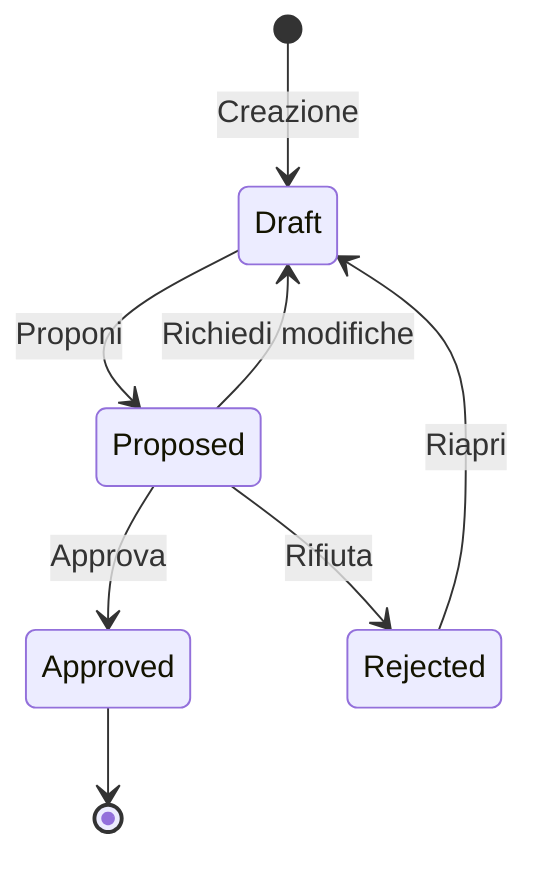
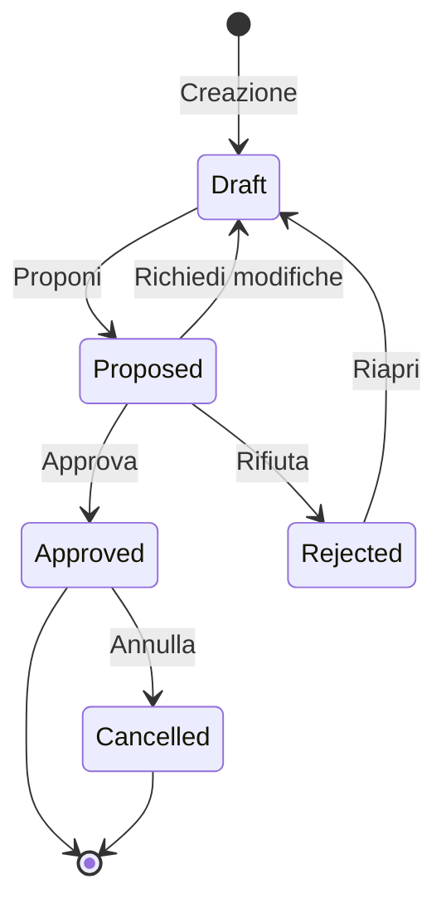

# Specifica Workflow Desiderato — Master Plan IT

> **Data**: 2026-01-09  
> **Stato**: Approvato dall'utente  
> **Obiettivo**: Migrare a Frappe Workflow nativi

---

## Decisioni Architetturali

| Decisione | Scelta |
|-----------|--------|
| Pattern Amend vs Reopen | **Reopen** (stesso documento, no copie) |
| Self-Approval | **Consentito** |
| Permessi vCIO Manager vs Client Editor | **Identici** |
| Client Viewer | **Sola lettura** |
| Notifiche email | **Tutte abilitate** |

---

## 1. MPIT Budget

### 1.1 Architettura

| Tipo | Workflow | Submittable |
|------|----------|-------------|
| **Live** | ❌ Nessuno | No (`docstatus=0` sempre) |
| **Snapshot** | ✅ Frappe Workflow nativo | Sì |

### 1.2 Snapshot Workflow

| Stato | Doc Status | Editabile | Note |
|-------|:----------:|:---------:|------|
| **Draft** | 0 | ✅ | Stato iniziale |
| **Proposed** | 0 | ❌ | In attesa approvazione |
| **Approved** | 1 | ❌ | Immutabile, riferimento governance |
| **Rejected** | 0 | ❌ | Può tornare Draft |

### 1.3 Transizioni Snapshot

| Da | A | Azione | Ruoli | Self-Approval |
|----|---|--------|-------|:-------------:|
| Draft | Proposed | Proponi | vCIO Manager, Client Editor | ✅ |
| Proposed | Draft | Richiedi Modifiche | vCIO Manager, Client Editor | ✅ |
| Proposed | Approved | Approva | vCIO Manager, Client Editor | ✅ |
| Proposed | Rejected | Rifiuta | vCIO Manager, Client Editor | ✅ |
| Rejected | Draft | Riapri | vCIO Manager, Client Editor | ✅ |

### 1.4 Regole Business

- Live: auto-gestito dal sistema, non richiede workflow
- Live cambia dopo Snapshot Approved: **nessun effetto** (Snapshot è fotografia storica)

---

## 2. MPIT Project

### 2.1 Architettura

| Proprietà | Valore |
|-----------|--------|
| Submittable | **No** |
| Workflow | ✅ Frappe Workflow nativo |
| Stati operativi | Campo separato `operational_status` |

### 2.2 Workflow Stati (Approvazione)

| Stato | Editabile | Incluso in Budget |
|-------|:---------:|:-----------------:|
| **Draft** | ✅ | ❌ |
| **Proposed** | ❌ | ❌ |
| **Approved** | ❌ | ✅ |
| **Rejected** | ❌ | ❌ |
| **Cancelled** | ❌ | ❌ |

### 2.3 Campo Separato: `operational_status`

Usato solo quando `workflow_state = Approved`:

| Stato Operativo | Descrizione |
|-----------------|-------------|
| **In Progress** | Lavoro in corso |
| **On Hold** | Sospeso |
| **Completed** | Completato (manuale) |

> [!NOTE]
> Il passaggio a Completed è **sempre manuale**, non automatico.

### 2.4 Transizioni Workflow

| Da | A | Azione | Ruoli | Self-Approval |
|----|---|--------|-------|:-------------:|
| Draft | Proposed | Proponi | vCIO Manager, Client Editor | ✅ |
| Proposed | Draft | Richiedi Modifiche | vCIO Manager, Client Editor | ✅ |
| Proposed | Approved | Approva | vCIO Manager, Client Editor | ✅ |
| Proposed | Rejected | Rifiuta | vCIO Manager, Client Editor | ✅ |
| Rejected | Draft | Riapri | vCIO Manager, Client Editor | ✅ |
| Approved | Cancelled | Annulla | vCIO Manager, Client Editor | ✅ |

### 2.5 Regole Business

- **Blocco approvazione**: Non si può approvare un progetto senza almeno 1 Planned Item submitted
- **Coverage**: La coverage dei Planned Items non influisce sullo stato workflow

---

## 3. MPIT Contract

### 3.1 Architettura

| Proprietà | Valore |
|-----------|--------|
| Submittable | **No** |
| Workflow formale | **No** |
| Campo stato | `status` (Select, gestione manuale + scheduler) |

### 3.2 Stati Operativi

| Stato | Gestione | Incluso in Budget |
|-------|----------|:-----------------:|
| **Draft** | Manuale | ❌ |
| **Active** | Manuale | ✅ |
| **Pending Renewal** | Manuale | ✅ |
| **Renewed** | Manuale | ✅ |
| **Expired** | **Automatico** (scheduler) | ❌ |
| **Cancelled** | Manuale | ❌ |

### 3.3 Automazioni

| Trigger | Comportamento |
|---------|---------------|
| `end_date` passata + `auto_renew=False` | → **Expired** (scheduler job) |
| `end_date` passata + `auto_renew=True` | → Resta **Active** (perpetuo) |

> [!IMPORTANT]
> **Pending Renewal** non viene impostato automaticamente. L'utente lo imposta manualmente quando desidera segnalare un contratto in scadenza.

---

## 4. Notifiche Email

Tutte le notifiche sono **abilitate**:

| Evento | Destinatari |
|--------|-------------|
| Snapshot proposta | Client Editor, Client Viewer |
| Snapshot approvata | vCIO Manager |
| Snapshot rifiutata | vCIO Manager |
| Progetto proposto | vCIO Manager |
| Progetto approvato | Team |
| Contratto in scadenza | vCIO Manager |

---

## 5. Matrice Permessi Finale

| Azione | vCIO Manager | Client Editor | Client Viewer |
|--------|:------------:|:-------------:|:-------------:|
| Creare Draft | ✅ | ✅ | ❌ |
| Proporre | ✅ | ✅ | ❌ |
| Approvare | ✅ | ✅ | ❌ |
| Rifiutare | ✅ | ✅ | ❌ |
| Riportare a Draft | ✅ | ✅ | ❌ |
| Cancellare | ✅ | ✅ | ❌ |
| Visualizzare | ✅ | ✅ | ✅ |

---

## Prossimi Passi

1. **Creare Workflow DocType** per MPIT Budget Snapshot
2. **Creare Workflow DocType** per MPIT Project
3. **Aggiungere campo** `operational_status` a MPIT Project
4. **Implementare scheduler** per auto-Expired su Contract
5. **Rimuovere logica custom** dai controller Python
6. **Configurare notifiche** via Workflow
7. **Test** delle transizioni e permessi
